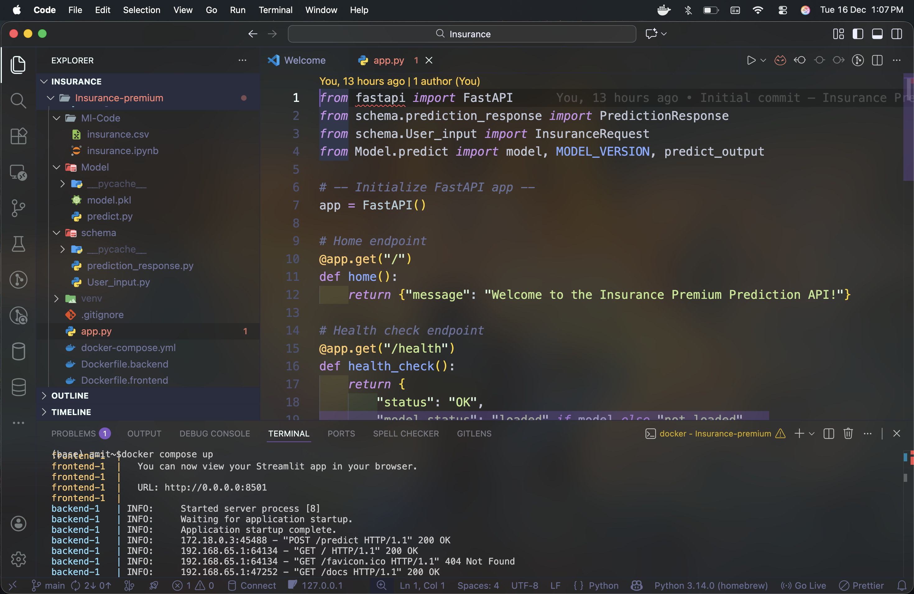
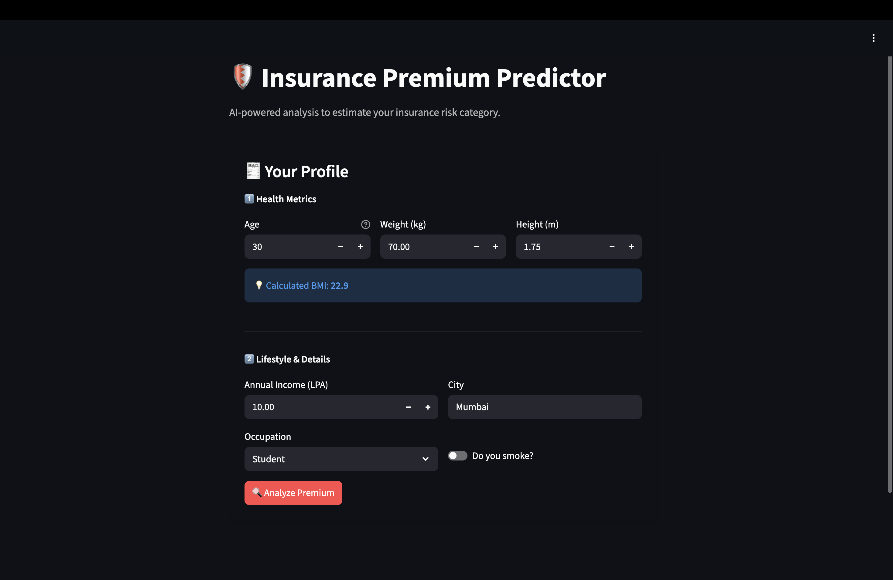
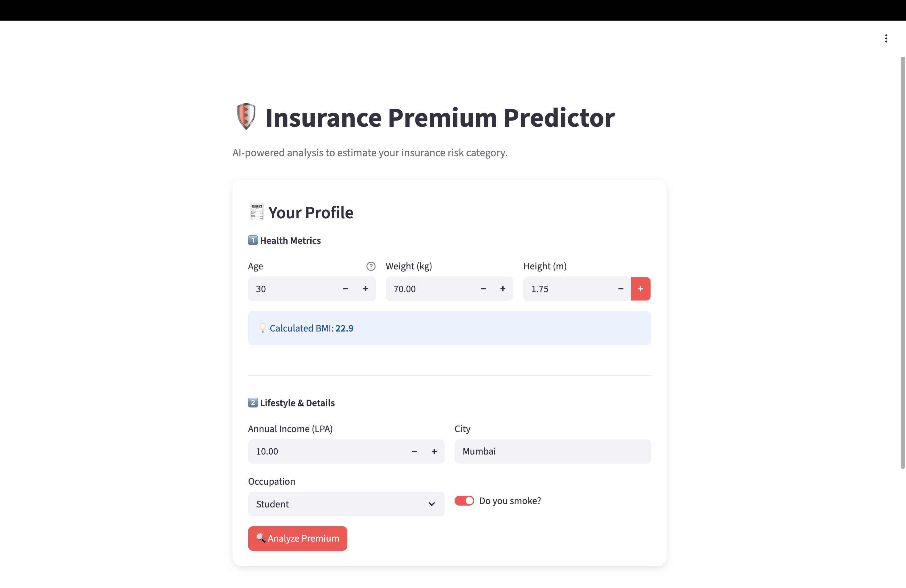
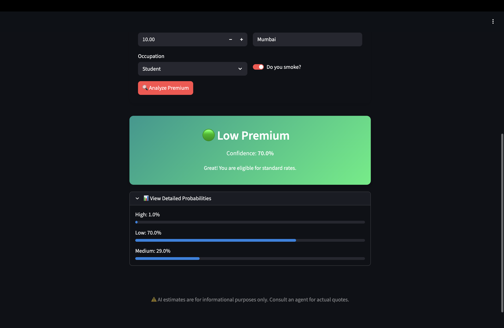
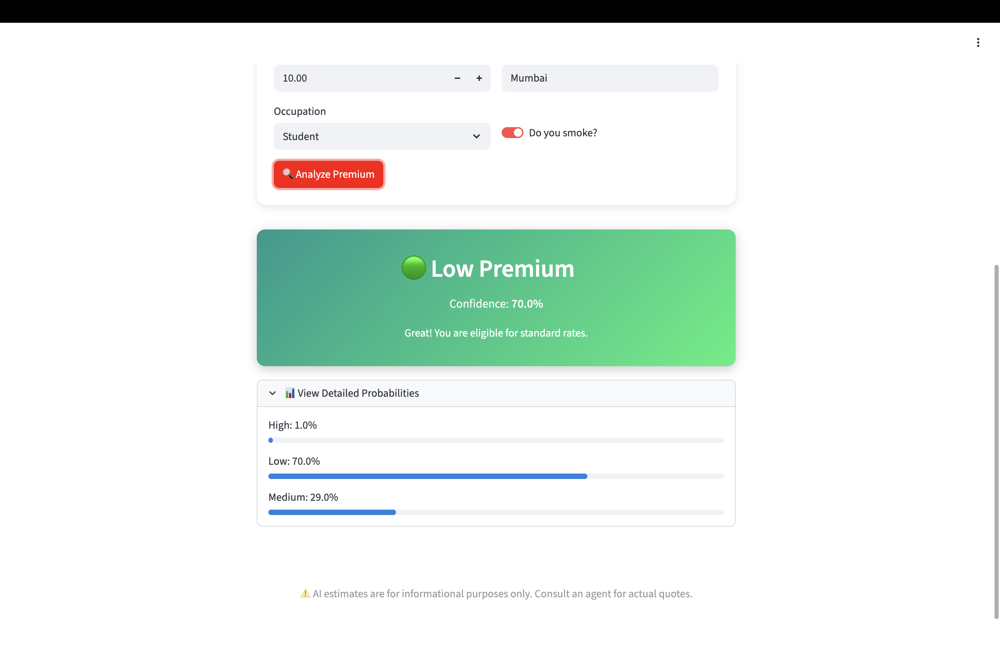
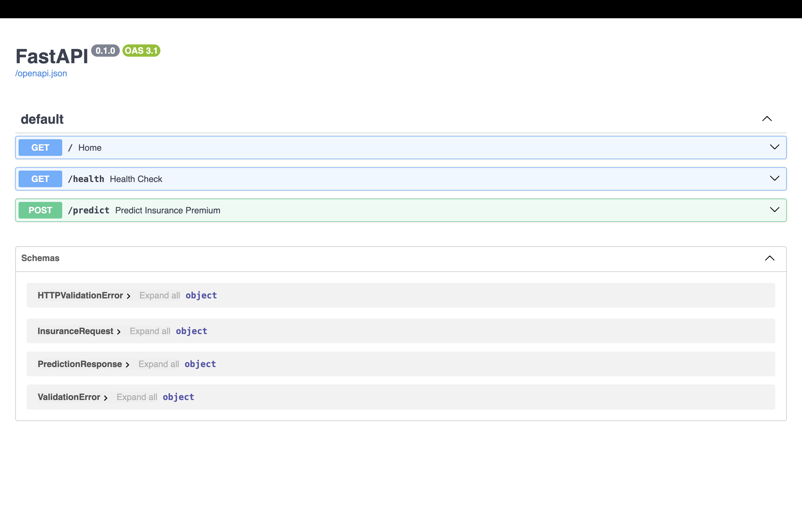
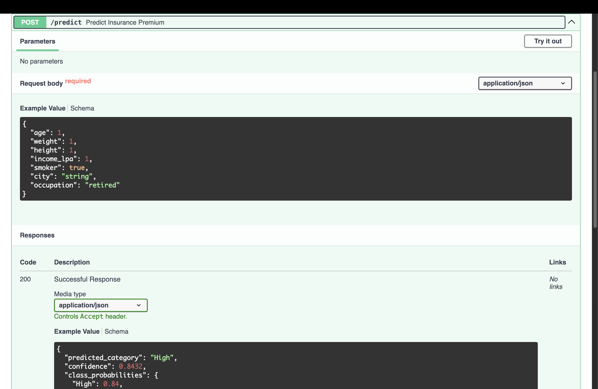

# 🛡️ Insurance Premium Prediction System
---

[](https://www.python.org/)
[](https://fastapi.tiangolo.com/)
[](https://streamlit.io/)
[](https://www.docker.com/)
[](https://github.com/PatelG108/Insurance-premium)

---
## 🌐 Live Demo

[](https://insurance-premium-prediction-iv8b.onrender.com)

---
## 🐳 Docker Images

 [](https://hub.docker.com/u/amitpatel108)
 
- Backend: https://hub.docker.com/r/amitpatel108/insurance-premium-backend
- Frontend: https://hub.docker.com/r/amitpatel108/insurance-premium-frontend
---


## 👤 Connect with Me

[](https://www.linkedin.com/in/amit-kumar-c/)
[](https://github.com/PatelG108)

---

An end-to-end **Machine Learning + Backend + Frontend** project that predicts an **Insurance Premium Category (Low / Medium / High)** based on user health, lifestyle, and financial information.

The project is fully **Dockerized** with:
- **FastAPI** as backend (ML inference API)
- **Streamlit** as frontend (modern UI)
- **Scikit-learn** trained ML model
- Clean schema validation using **Pydantic**


## 🚀 Features

- Predict insurance premium category
- Confidence score for prediction
- Probability distribution for all classes
- Modern UI with color-coded results
- Health check & model versioning
- Docker & Docker Compose support
- Production-ready project structure

---

## 🖼️ Application Screenshots

### 🔹 VS-Code


### 🔹 Streamlit Frontend



### 🔹 Prediction Result



### 🔹 FastAPI Swagger Docs



---

## 🧠 Tech Stack

### Backend
- Python
- FastAPI
- Pydantic
- Scikit-learn
- Pandas

### Frontend
- Streamlit
- Custom CSS

### DevOps
- Docker
- Docker Compose
- GitHub

---

## 📦 Project Structure

```
Insurance-premium/
│
├── app.py                      # FastAPI application entry point
├── frontend.py                 # Streamlit frontend UI
│
├── docker-compose.yml          # Run backend & frontend together
├── Dockerfile.backend          # Backend Docker image
├── Dockerfile.frontend         # Frontend Docker image
│
├── requirements-backend.txt    # Backend dependencies
├── requirements-frontend.txt   # Frontend dependencies
│
├── Model/
│   ├── model.pkl               # Trained ML model
│   └── predict.py              # Prediction logic
│
├── schema/
│   ├── User_input.py           # Input validation schema
│   └── prediction_response.py  # Output response schema
│
├── config/
│   └── city_tier.py            # City tier mapping logic
│
├── Ml-Code/
│   ├── insurance.csv           # Training dataset
│   └── insurance.ipynb         # Model training notebook
│
├── venv/                       # Virtual environment (ignored in Git)
├── .gitignore                  # Git ignore rules
└── .vscode/                    # VS Code settings

```

## 👨🏻‍💻 Example

```
json

{
  "age": 30,
  "weight": 65,
  "height": 1.7,
  "income_lpa": 10,
  "smoker": true,
  "city": "Mumbai",
  "occupation": "private_job"
}

```
### Response

```
json

{
  "predicted_category": "Low",
  "confidence": 0.47,
  "class_probabilities": {
    "Low": 0.47,
    "Medium": 0.45,
    "High": 0.08
  }
}

```
---
# 👤 Author

📌 Developed by **Amit Kumar**  

[](https://www.linkedin.com/in/amit-kumar-c/)
[](https://github.com/PatelG108)


- B.Tech CSE (Data Science)
- Focus: AI · ML · Backend · Deployment

